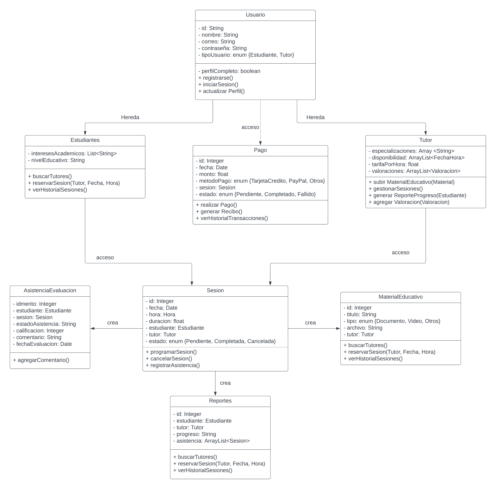
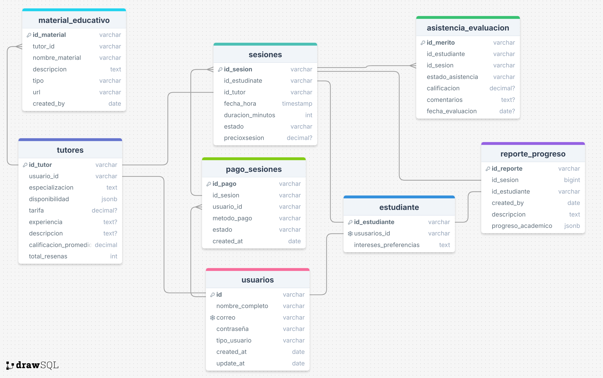

## Introducción

**LearnGo** es una aplicación web diseñada para mejorar la eficacia al momento de brindar sesiones de clases particulares y a la vez queremos mejorar el poder recibir estas sesiones. Se busca mejorar la experiencia tanto para el profesor, estudiantes y/o apoderados. Con LearnGo, los usuarios pueden crear una cuenta, iniciar sesión, y realizar el pago de manera segura a través de PayPal para adquirir una sesión de un curso deseado. La aplicación permite a los tutores realizar operaciones CRUD (Crear, Leer, Actualizar, Eliminar) sobre sesiones de clases, material de clase y reporte de progreso.

El propósito de LearnGo es ofrecer una plataforma integrada que combine la facilidad de obtener clases de tutoría para así tener un mejor apoyo académico en su día a día , la gestión del catálogo por parte de los tutores, y la personalización de clases virtuales por parte de los usuarios, todo en un entorno seguro y amigable.
### Integrantes

| **Nombres**            | **funcion**         | **Perfil**                                                 |
|------------------------|---------------------|------------------------------------------------------------|
| Silva Merino Jose      | Líder del Proyecto  |            |
| Campos Siccha Fernando | Integrante Proyecto |            |
| Ñiquén Cáceres David   | Integrante Proyecto |            |

### Revisa el Progreso del Proyecto LearnGo

| **Columna**       | **Descripción**                                                                                                                                                                                                                                                              |
|-------------------|------------------------------------------------------------------------------------------------------------------------------------------------------------------------------------------------------------------------------------------------------------------------------|
| **Backlog**       | Contiene todas las historias de usuario, tareas y características que deben desarrollarse grupalmente. Es el listado de todo el trabajo pendiente.                                                                                                                           |
| **En Progreso**   | Incluye las tareas que están actualmente en desarrollo. Visualiza el trabajo en curso para asegurar el flujo continuo de trabajo.                                                                                                                                            |
| **Revisión**      | Después de completar una tarea, se mueve aquí para una revisión de código y revisión por pares (peer review). Esta fase incluye la creación de **pull requests** para asegurar que el código cumpla con los estándares de calidad antes de integrarse al proyecto principal. |
| **En Pruebas**    | Contiene las tareas que han pasado la revisión de código y necesitan pruebas exhaustivas (unitarias, de integración y de aceptación) para garantizar su calidad.                                                                                                             |
| **Hecho**         | Las tareas completamente desarrolladas, revisadas y probadas se mueven aquí, indicando que están listas y finalizadas.                                                                                                                                                       |

Mira cómo va avanzando nuestro trabajo visitando el siguiente enlace: [Tablero de Trello](https://trello.com/b/i621bTDB/transaccional).

### Funcionalidades de la Aplicación LearnGo

#### **Módulo de Gestión de Usuarios**

- **Registro y Gestión de Perfiles:**
  - Permitir a los usuarios registrarse en la plataforma.
  - Permite Editar la informacion de los usuarios.
  - Facilitar la gestión de perfiles, donde los tutores pueden detallar sus especializaciones, disponibilidad, descripcion general, etc.
  - Los estudiantes podrán personalizar sus intereses  y preferencias.

#### **Módulo de Pagos en Línea**

- **Pago de Sesiones**
  - Lo usuario puede contar con un sistema de pagos en Linea.
  - Diferentes metodos de pago.
  - Poder Revisar el estado del pago e incluso cuando este finalice, pueden acceder a la informacion de este.

#### **Gestion de Asistencia y Evaluaciones**

- **Asistencia**
  - Permitir a los tutores subir documentos, videos y otros materiales educativos.
  - Facilitar la revisión de materiales por parte de los estudiantes antes o después de las sesiones.
  - Aceptar diversos formatos de archivos (PDF, Word, Excel, videos)

- **Evaluacion:**
  - Funcionalidad para registrar la asistencia a las sesiones.
  - Mantenimiento de un historial de interacciones entre estudiantes y tutores.

#### **Módulo de Reportes y Evaluación del Progreso**

- **Reportes de Rendimiento:**
  - Generación de reportes gráficos sobre el progreso de los estudiantes.
  - Inclusión de estadísticas de asistencia, calificaciones y recomendaciones para mejorar el rendimiento.

- **Feedback y Evaluaciones:**
  - Evaluación del desempeño del estudiante por parte del tutor.
  - Provisión de feedback para el desarrollo académico del estudiante.

## Diagramas de la Aplicación

Para entender mejor la estructura y diseño de la aplicación "Aprendeya", revisa los siguientes diagramas:

### Diagrama de Clases

### Diagrama de Base de Datos

Este diagrama ilustra el esquema de la base de datos utilizada por la aplicación, mostrando las tablas, columnas, y relaciones entre las entidades.

### Descripción de Capas del Proyecto

| capa        | descripción                                                                                  |
|-------------|----------------------------------------------------------------------------------------------|
| api         | Contiene los controladores REST que manejan las solicitudes HTTP y las respuestas.            |
| entity      | Define las entidades del modelo de datos que se mapean a las tablas de la base de datos.      |
| repository  | Proporciona la interfaz para las operaciones CRUD y la interacción con la base de datos.      |
| service     | Declara la lógica de negocio y las operaciones que se realizarán sobre las entidades.         |
| service impl| Implementa la lógica de negocio definida en los servicios, utilizando los repositorios necesarios. |

# Asignación de Historias de Usuario

**Sprint 1:** Funcionalidades Básicas  
*Enfocado en implementar las funcionalidades esenciales para la gestión de usuario y gestion de perfiles.*

| Integrante     | Módulo                             | Historia de Usuario                    | Descripción                                                                                        | Tipo |
|----------------|------------------------------------|----------------------------------------|----------------------------------------------------------------------------------------------------|------|
| Juan Valeriano | Módulo de Gestión de Usuarios      | HU01: Registro de Usuario              | Como usuario, quiero registrarme en la plataforma, para acceder a los servicios de tutoría.| CRUD |
|                |                                    | HU02: Gestión de Perfil del Estudiante | Como estudiante, quiero personalizar mi perfil con mis intereses académicos y preferencias de aprendizaje, para recibir recomendaciones de tutores relevantes.| CRUD |
|                |                                    | HU03: Gestión de Perfil del Tutor      | Como tutor, quiero gestionar mi perfil con mis áreas de especialización, disponibilidad y tarifas, para atraer a estudiantes interesados. | CRUD |
|                |                                    | HU04: Recuperación de Contraseña       |Como usuario, quiero poder recuperar mi contraseña si la olvido, para acceder nuevamente a la plataforma. | CRUD |
|                |                                    | HU05: Desactivación de Cuenta de Usuario| Como usuario, quiero poder desactivar mi cuenta, para dejar de usar la plataforma | CRUD |

**Sprint 2:** Integración de Funcionalidades 
*Búsqueda de tutores y reservas de sesiones*

| Integrante     | Módulo                             | Historia de Usuario                      | Descripción                                                                                       | Tipo |
|----------------|------------------------------------|------------------------------------------|---------------------------------------------------------------------------------------------------|------|
| Juan Valeriano | Módulo de Búsqueda y Selección de Tutores| HU06: Búsqueda de Tutores por Materia    | Como estudiante, quiero buscar tutores por materia, para encontrar un tutor especializado en la materia que deseo aprender.| CRUD |
| Emerson Lezama |                                    | HU07: Filtro de Búsqueda Avanzada        | Como estudiante, quiero usar filtros avanzados para buscar tutores por calificaciones, disponibilidad y tarifas**, para encontrar un tutor que se ajuste a mis criterios específicos.| CRUD |
|                |                                    | HU08: Visualización del Perfil del Tutor | Como estudiante, quiero visualizar los perfiles detallados de los tutores, para conocer sus credenciales y leer comentarios de otros estudiantes. | CRUD |
|                |                                    | HU09: Reserva de Sesiones Individuales   |Como estudiante, quiero reservar una sesión de tutoría individual**, para recibir atención personalizada en la materia que necesito.| CRUD |
|                |                                    | HU10: Reserva de Sesiones Grupales       |Como estudiante, quiero reservar una sesión de tutoría grupal**, para compartir costos y aprender en grupo.| CRUD |
|                |                                    | HU11: Evaluación de Tutores por Estudiantes     |Como estudiante, quiero evaluar a los tutores después de cada sesión, para ayudar a otros estudiantes a tomar decisiones informadas.| CRUD |
|                |                                    | HU12: Ver Comentarios de Estudiantes sobre Tutores       |Como estudiante, quiero ver los comentarios y calificaciones de otros estudiantes sobre los tutores, para seleccionar el tutor más adecuado.| CRUD |

**Sprint 3:** Integración de Funcionalidades
*Gestión de pagos y cancelaciones*

| Integrante | Módulo                    | Historia de Usuario                     | Descripción                                                                                     | Tipo |
|------------|---------------------------|-----------------------------------------|-------------------------------------------------------------------------------------------------|------|
|            | Módulo de Pagos en Línea  | HU13: Suscripción a Paquetes de Tutoría | Como estudiante, quiero suscribirme a paquetes de tutoría, para obtener un descuento en múltiples sesiones.| CRUD |
|            |                           | HU14: Pago por Sesión                   | Como estudiante, quiero poder pagar por las sesiones de tutoría que reservo**, para confirmar mi asistencia a la sesión.| CRUD |
|            |                           | HU15: Gestión de Métodos de Pago        | Como usuario, quiero gestionar mis métodos de pago, para mantenerlos actualizados y seguros.| CRUD |
|            |                           | HU16: Visualización de Historial de Transacciones|Como usuario, quiero visualizar mi historial de pagos**, para mantener un registro claro de mis gastos en tutorías.| CRUD |
|            |                           | HU17: Confirmación de Pago por Notificación |Como estudiante, quiero recibir una notificación de confirmación después de realizar un pago, para asegurarme de que mi transacción ha sido exitosa.| CRUD |
|            |                           | HU18: Cancelación de Sesión Reservada  |Como estudiante, quiero cancelar una sesión de tutoría reservada, para ajustar mi horario o evitar cargos si no puedo asistir.| CRUD |

**Sprint 4:** Integración de Funcionalidades
*Materiales educativos y reportes de rendimiento*

| Integrante | Módulo                    | Historia de Usuario                                       | Descripción                                                                                                                                   | Tipo |
|------------|---------------------------|-----------------------------------------------------------|-----------------------------------------------------------------------------------------------------------------------------------------------|------|
|            |Módulo de Gestión de Sesiones y Materiales Educativos| HU19: Subida de Materiales Educativos                     | Como tutor, quiero subir materiales educativos**, para proporcionar recursos adicionales a los estudiantes. | CRUD |
|            |                           | HU20: Gestión de Materiales Subidos                       | Como tutor, quiero gestionar los materiales educativos que he subido**, para mantenerlos actualizados y relevantes.| CRUD |
|            |                           | HU21: Registro de Asistencia                              | Como tutor, quiero registrar la asistencia de los estudiantes a las sesiones**, para mantener un historial de participación. | CRUD |
|            |                           | HU22: Notificación de Subida de Materiales                |Como estudiante, quiero recibir notificaciones cuando un tutor suba nuevos materiales educativos**, para estar al tanto de los recursos adicionales disponibles.| CRUD |
|            |                           | HU23: Descarga de Materiales Educativos                   | Como estudiante, quiero poder descargar los materiales educativos subidos por el tutor, para estudiarlos offline. | CRUD |
|            |Módulo de Reportes y Evaluación del Progreso | HU25: Generación de Reportes de Rendimiento               |Como tutor, quiero generar reportes gráficos sobre el progreso de los estudiantes**, para evaluar su rendimiento y ofrecer recomendaciones.| CRUD |
|            |                           | HU26: Solicitud de Reporte de Rendimiento por Estudiantes |Como estudiante, quiero solicitar un reporte de mi rendimiento académico, para entender mi progreso y áreas de mejora. | CRUD |
|            |                           | HU26: Provisión de Feedback después de la Sesión |Como tutor, quiero ofrecer feedback detallado después de cada sesión**, para ayudar al estudiante en su desarrollo académico.| CRUD |

**Sprint 5:** Integración de Funcionalidades Avanzadas
*Acceso a datos y funcionalidades avanzadas*

| Integrante | Módulo                    | Historia de Usuario                                    | Descripción                                                                                                           | Tipo |
|------------|---------------------------|--------------------------------------------------------|-----------------------------------------------------------------------------------------------------------------------|------|
|            |Reportes y Evaluación del Progreso| HU27: Actualización de Datos Personales de Estudiantes | Como estudiante, quiero actualizar mis datos personales**, para mantener mi información actualizada en la plataforma. | CRUD |
|            |                           | HU28:                                                  |                                                                                                                       | CRUD |
|            |                           | HU29:                                                  |                                                                                                                       | CRUD |

## Recomendaciones

1. **Comunicación Constante:** Mantener una comunicación abierta y constante entre todos los miembros del equipo para resolver dudas y compartir avances. Utilizar herramientas colaborativas como Slack o Microsoft Teams para facilitar la interacción.

2. **Revisión de Código:** Implementar prácticas de revisión de código entre pares para asegurar la calidad del software y fomentar el aprendizaje mutuo. Esto ayudará a detectar errores a tiempo y a mejorar la calidad del código entregado.

3. **Gestión del Tiempo:** Planificar y gestionar bien el tiempo para cada historia de usuario, priorizando aquellas que son críticas para el funcionamiento básico del sistema. Utilizar técnicas como el método Pomodoro para mantener la concentración y eficiencia.

4. **Pruebas Continuas:** Realizar pruebas continuas de las funcionalidades desarrolladas para identificar y corregir errores tempranamente. Asegurar que cada historia de usuario esté completamente probada antes de considerarla terminada.

5. **Documentación Clara:** Mantener una documentación clara y actualizada del código y de las decisiones tomadas durante el desarrollo. Esto facilitará el mantenimiento y futuras mejoras del producto.

6. **Retroalimentación Regular:** Programar sesiones regulares de retroalimentación al final de cada sprint para evaluar lo que funcionó bien y qué se puede mejorar. Utilizar estas sesiones para ajustar las estrategias y métodos de trabajo según sea necesario.

7. **Enfoque en el Usuario:** Mantener siempre al usuario final en mente durante el desarrollo. Asegurar que todas las funcionalidades implementadas aporten valor al usuario y mejoren su experiencia con la plataforma.

8. **Gestión de Riesgos:** Identificar posibles riesgos que puedan afectar el desarrollo del proyecto y planificar estrategias para mitigarlos. Esto incluye problemas técnicos, falta de recursos o cambios en los requisitos.

9. **Optimización del Rendimiento:** Asegurarse de que las funcionalidades añadidas no comprometan el rendimiento del sistema. Realizar pruebas de carga y optimización cuando sea necesario para garantizar una experiencia de usuario fluida.

10. **Preparación para el Lanzamiento:** A medida que se acerque el final del segundo sprint, prepararse para el lanzamiento del producto con un plan de despliegue claro, asegurando que todas las funcionalidades estén completamente probadas y documentadas.
